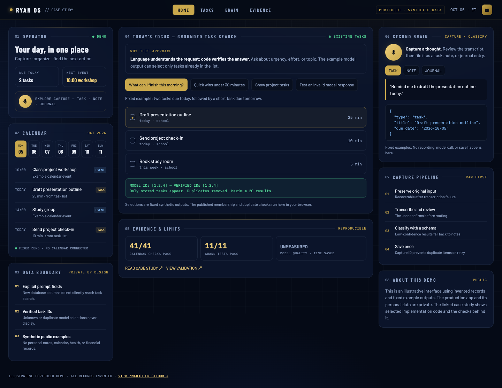
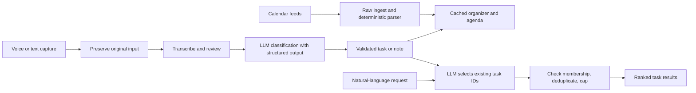

# ryan-os

**From scattered commitments to a daily organizer — an applied ML case study.**

I built ryan-os because keeping track of tasks, notes, and calendars was becoming its own task. I wanted a place to capture an idea quickly, turn it into something actionable, and see it alongside the rest of my day.

This repository presents a curated part of my personal operating system: voice capture, structured classification, task search, and a combined calendar agenda. It includes selected implementation excerpts and a standalone demonstration using invented data. It does not contain my personal records or the private application's configuration.

[](assets/demo.png)

**Start here:** [Case study](CASE_STUDY.md) · [Validation and limitations](VALIDATION.md) · [Application answer](APPLICATION.md)

## The problem

Capturing something and deciding what to do with it are two different problems. A voice note is easy to record, but it can still disappear into a pile of unstructured text. A task list stores obligations, but a keyword search does not answer “what can I finish in the next 30 minutes?”

I wanted to learn whether an LLM could help with those two steps while keeping the saved data and task selections verifiable.

## What I built

- **Capture:** preserve the original recording, transcribe it, and let the user review the text before confirming.
- **Classify:** use a small language model and a structured schema to distinguish a task from a note, journal entry, connection, or meal.
- **Organize:** store tasks with urgency, due dates, estimated effort, and manual ordering.
- **Find:** use natural-language requests to select and rank existing tasks. Code removes unknown IDs and duplicates and caps the result at 20.
- **Plan the day:** show cached calendar events and open tasks together in a seven-day agenda, using America/New_York for day boundaries.

The stack behind the full application is Next.js, TypeScript, Supabase/Postgres, Claude, Whisper, and GitHub Actions. Page loads read cached data; model calls happen only through an explicit action or scheduled job.



## Why this approach

The language model handles language: deciding what kind of capture this is and interpreting a request. Deterministic code handles the parts that must be exact: IDs, dates, duplicate prevention, and persistence. For a personal list capped at 300 active tasks, sending explicitly selected task fields is a straightforward way to give the ranker enough context without building a separate learned ranking model.

## Evidence

The calendar acceptance suite was rerun for this case study: **41 checks passed**, using an in-memory database and stubbed fetches. The extracted task-selection guards have a separate offline test suite. Historical capture checks also exercised concurrent confirmation, repeated confirmation, a capture before ET midnight, and a missing-name fallback.

Those checks establish specific software properties. They do **not** establish classification accuracy, ranking quality, or a measured reduction in time spent organizing. See [VALIDATION.md](VALIDATION.md) for the distinction and the next evaluation I would run.

## Explore the code

| File | What it shows |
|---|---|
| [Classifier schema and prompt](excerpts/classifier.ts) | Structured capture classification |
| [Task-search route](excerpts/task-search.route.ts) | Explicit prompt fields and grounded result selection |
| [Audio-capture route](excerpts/audio-capture.route.ts) | Preserve audio before transcription; check saved results |
| [Capture-confirmation excerpts](excerpts/capture-confirm.ts) | Capture-date anchoring, safe routing, and retry protection |
| [Task-selection guards](src/task-selection.mjs) | Standalone extraction of the field whitelist and ID guard |
| [Synthetic examples](demo/fixtures.mjs) | Invented tasks and fixed example model outputs |

The `.ts` files are excerpts from the private application, not a deployable copy. Their provenance and omissions are documented in [SOURCE_NOTES.md](SOURCE_NOTES.md).

## Run the public demonstration

Requires Node.js 20 or newer; there are no dependencies, credentials, or model calls.

```sh
npm test
npm run demo
```

Open `http://127.0.0.1:4173`. The demo replays fixed synthetic outputs and uses the published ID guard. It illustrates the workflow; it is not the production app and does not perform live transcription or inference.

The visual design adapts my command center mockup. The organizer content shown here is synthetic; the original mockup's personal examples are not published.

## Result and limits

The result is a deployed personal organizer that brings capture, tasks, and calendar context together. The public demo lets a reviewer follow that workflow without access to private data. I am the sole user; broader usefulness and any time saved remain unmeasured. The next step is a labeled capture and task-ranking evaluation, followed by a small comparison against keyword search.
